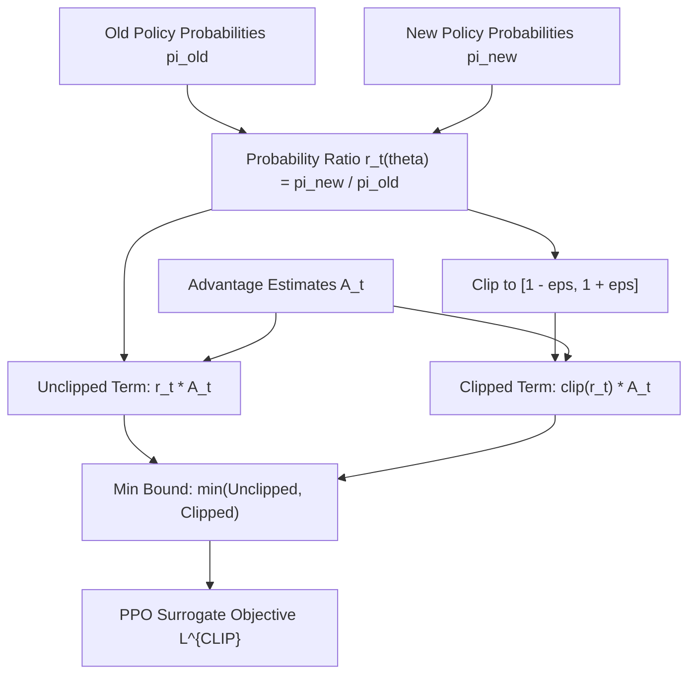

# genpark-ppo-clipped-surrogate-objective-skill

Agent Skill implementing the **Proximal Policy Optimization (PPO) Clipped Surrogate Objective**, ensuring bounded policy parameter updates in RL and RLHF pipelines.

## Architectural Overview

